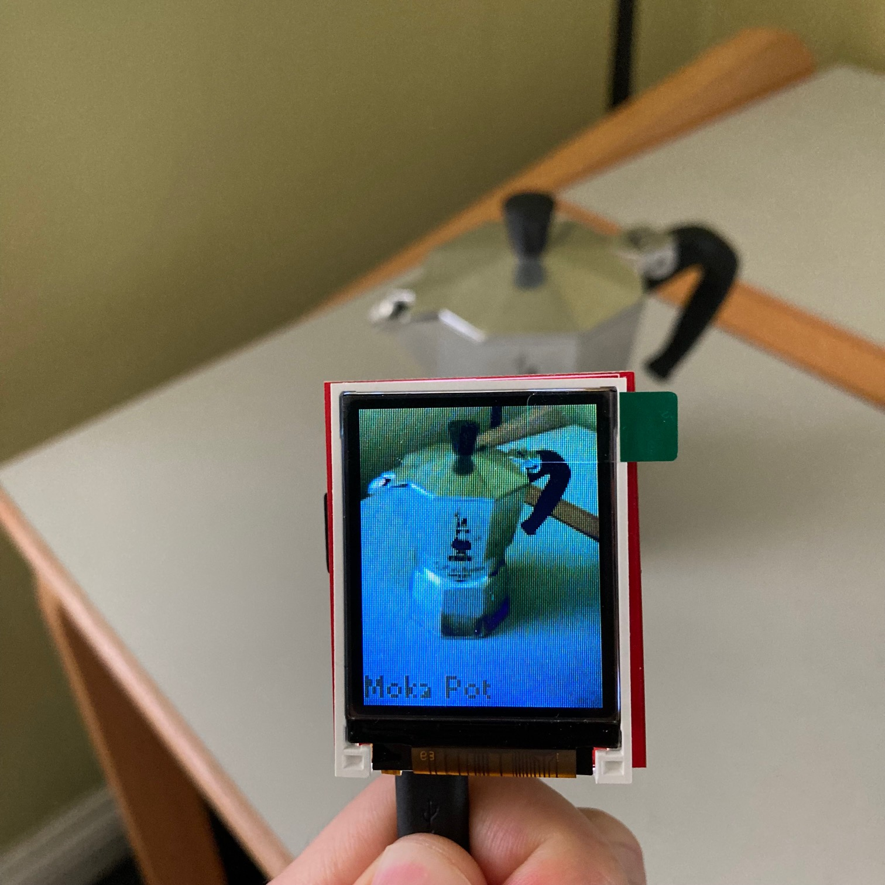
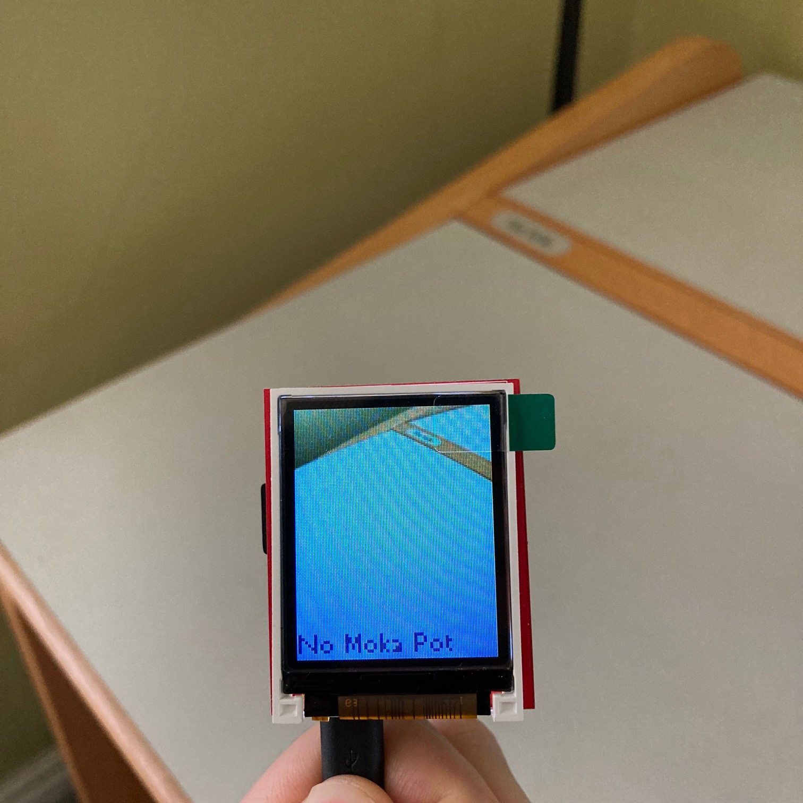
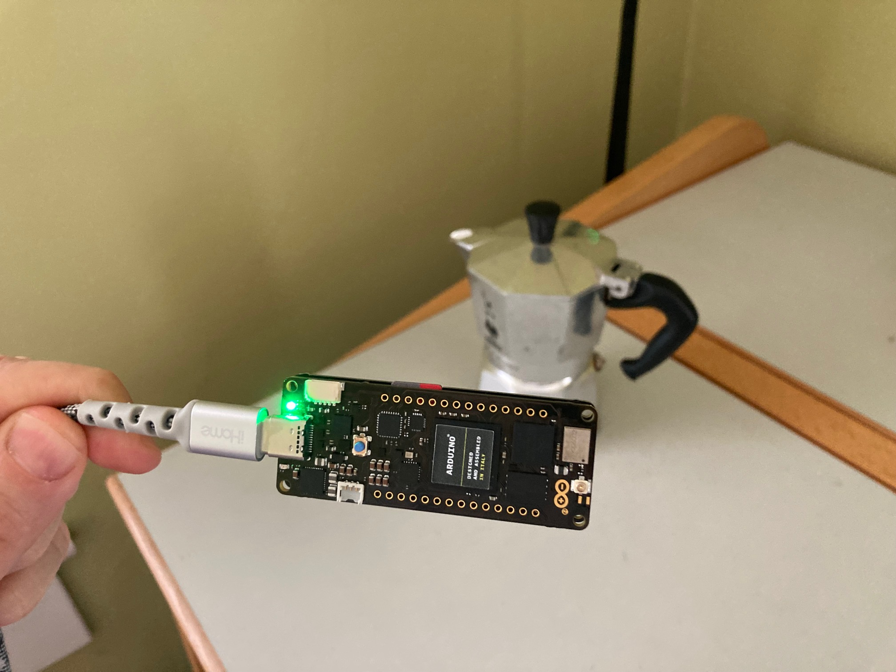
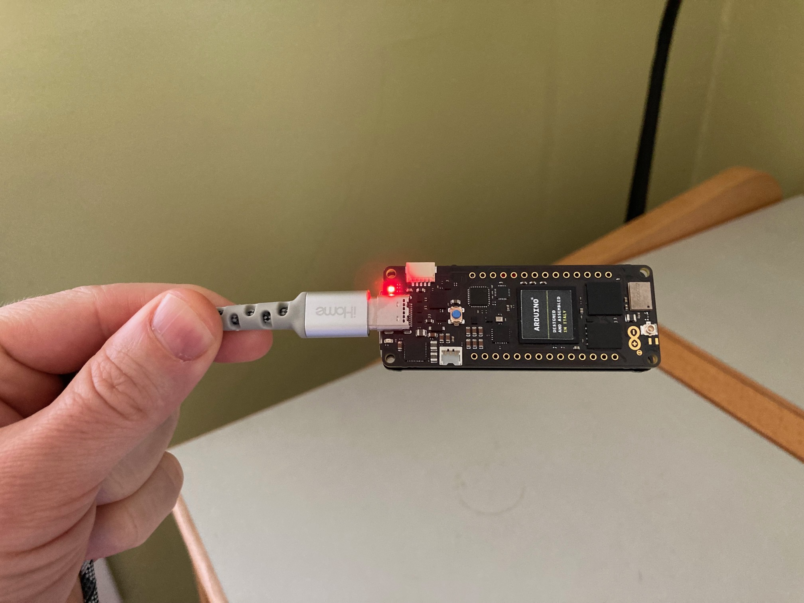

# MokaPotNet

On device machine learning to detect a Moka Pot. 

- TensorFlow (TF Lite Micro)
- Arduino Portenta (+ Vision Shield)
- OpenMV H7+ (w/ LCD shield)
- OpenMV IDE

## OpenMV H7+ (w/ LCD shield)

Moka Pot

No Moka Pot

## Arduino Portenta

Green LED - Moka Pot detected

Red LED -  No Moka Pot detected

